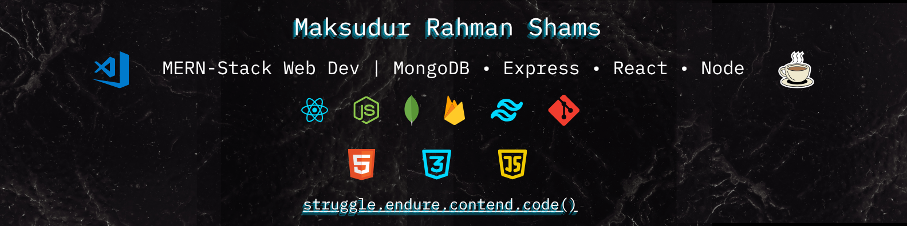
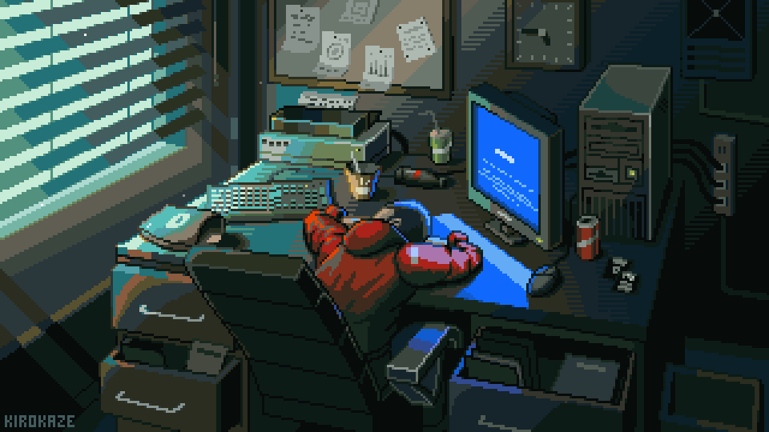
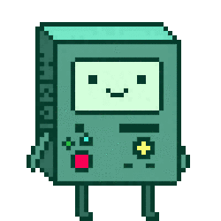

<!--? Introduction -->

    <h2>
    
        Hey there!
        I'm Shams
    </h2>
    

        💻 MERN Stack Developer &nbsp&nbsp ⚔️ Dual-Wielding Frontend & Backend &nbsp&nbsp 🚀 Solving Real-World Challenges with Code
    

 

<!-- ?About -->

    

        
        <!--  -->
    

    <h2>
         About Me
    </h2>
    

        Computer Science & Technology student, who finds purpose in writing code, preferably with a cup of coffee nearby ☕. 
        🔥 Currently, I'm engaged in MERN stack development - exploring frontend technologies such as React, modern component libraries, and UI/UX best practices, while also diving into backend development, database design, and web security. Preparing myself to be a well-rounded full-stack developer. 
        🚀 Future Plans: I plan to deepen my expertise in React and Node.js, followed by exploring advanced technologies like Next.js and TypeScript. Additionally, I aim to expand my understanding of backend tools such as Docker, WebSockets, and cloud services. 
        🎉 Fun Fact: When I’m not coding, I’m usually deep into a manga or book 📚. Some day, I'd love to dive into Arduino projects and build something fun.
    

---

<!-- ?Tech stack -->

    <h2>
         Technology Stack
    </h2>
    <!-- *Frontend Techs -->
    <b>
        🎨 Front-end Technologies
    </b>
     
     
    

        
        &nbsp&nbsp
        
        &nbsp&nbsp
        
        &nbsp&nbsp
        
        &nbsp&nbsp
        
        &nbsp&nbsp
        
        &nbsp&nbsp
        
        &nbsp&nbsp
        
        &nbsp&nbsp
        
        &nbsp&nbsp
    

    <!-- *Backend Techs -->
    <b>
        🖧 Back-end Technologies
    </b>
     
     
   

        
        &nbsp&nbsp
        
        &nbsp&nbsp
        
        &nbsp&nbsp
        
        &nbsp&nbsp
    

    <!--* Tools -->
    <b>🛠️ Tools & Utilities</b>
     
     
    

        
        &nbsp&nbsp
        
        &nbsp&nbsp
        
        &nbsp&nbsp
        
        &nbsp&nbsp
        
        &nbsp&nbsp
        
        &nbsp&nbsp
        
        &nbsp&nbsp
        
        &nbsp&nbsp
        
        &nbsp&nbsp
        
        &nbsp&nbsp
    

 

<!-- ?Stats Section -->
<table>
  <tr>
    <!-- Left: Stats Section with toggle -->
    <td valign="top" width="55%">
      

        

          <strong> GitHub Stats</strong>
        

         
        
         
        
         
        
      

       
      <h3>📜 Code & Philosophy</h3>
      
    </td>
    <!-- Right: Fun GIF -->
    <td valign="top" width="45%" align="center">
      
    </td>
  </tr>
</table>

